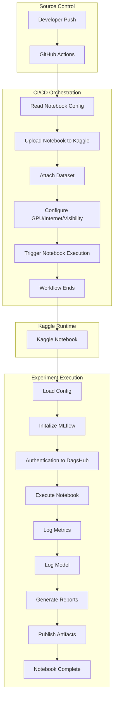
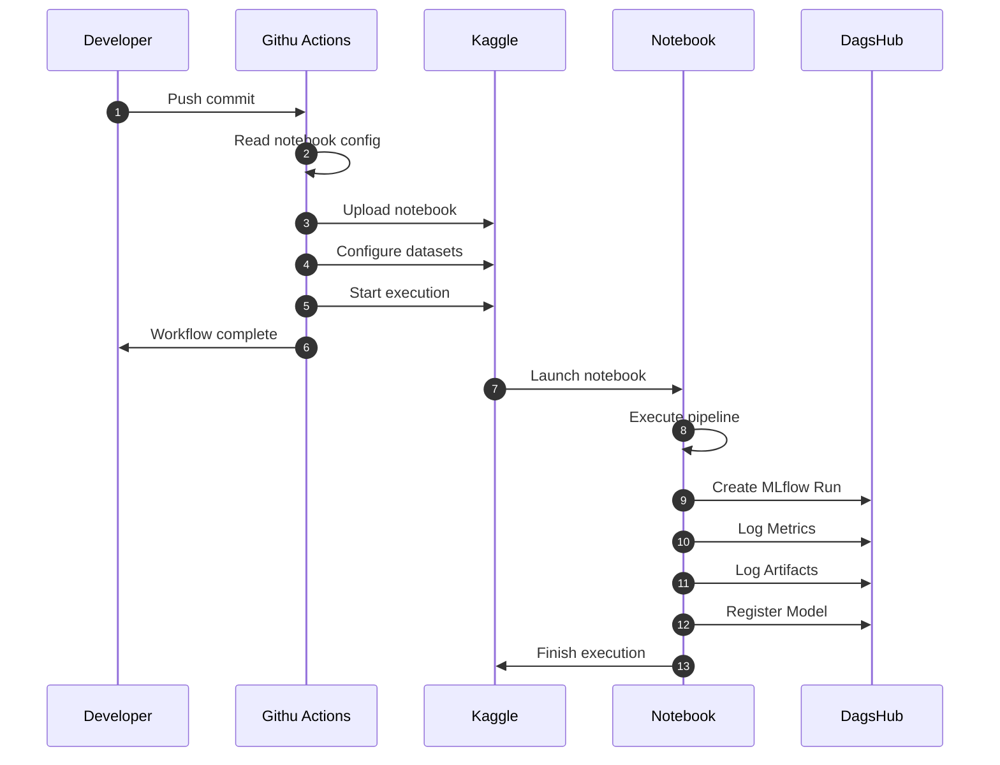

# Execute Pipeline Locally

Once your .secrets file is ready, navigate to your root directory in the terminal and execute this tailored command:

```bash
act push \
  -s FORCE_JAVASCRIPT_ACTIONS_TO_NODE24=true \
  --secret-file .secrets \
  --container-architecture linux/amd64

```

## Pipeline:

```bash

Job 1 (Read Config)
────────────────────────
Outputs
• notebook path
• execute flag
• slug
• gpu
• dataset list
• kernel sources
        │
        ▼
Job 2 (Package)
────────────────────────
Produces
• modified notebook
• kernel-metadata.json
        │
   Upload Artifact
        │
        ▼
Job 3 (Upload)
────────────────────────
Downloads artifact
Pushes to Kaggle
Returns kernel URL (output)
        │
        ▼
Job 4 (Summary)
────────────────────────
Uses kernel URL
Creates GitHub Job Summary

```

## Example:

```
name: Dynamic Kaggle Fire-and-Forget Pipeline

on:
  push:
    branches:
      - feat/notebooks
    paths:
      - "notebooks/*.ipynb"
      - ".github/workflows/kaggle-cicd.yml"
      - "pyproject.toml"

################################################################################
# Job 1 - Read Notebook Config
################################################################################
jobs:

  read-config:
    name: Read Notebook Config
    runs-on: ubuntu-latest

    outputs:
      execute: ${{ steps.detect.outputs.execute }}
      notebook: ${{ steps.detect.outputs.notebook }}
      slug: ${{ steps.detect.outputs.slug }}
      enable_gpu: ${{ steps.detect.outputs.enable_gpu }}
      dataset_sources: ${{ steps.detect.outputs.dataset_sources }}
      kernel_sources: ${{ steps.detect.outputs.kernel_sources }}

    steps:

      - Checkout repository

      - Detect changed notebook

      - Parse notebook configuration

      - Validate configuration

      - Export job outputs


################################################################################
# Job 2 - Package Notebook
################################################################################

  package-notebook:

    name: Package Notebook

    runs-on: ubuntu-latest

    needs: read-config

    if: needs.read-config.outputs.execute == 'true'

    steps:

      - Checkout repository

      - Setup Python / uv

      - Inject runtime variables

      - Inject GitHub metadata
          • SHA
          • Branch
          • Workflow Run ID
          • Timestamp

      - Generate kernel-metadata.json

      - Validate metadata

      - Upload packaged notebook
        (GitHub Artifact)


################################################################################
# Job 3 - Upload to Kaggle
################################################################################

  upload-kaggle:

    name: Upload Notebook to Kaggle

    runs-on: ubuntu-latest

    needs: package-notebook

    steps:

      - Download packaged artifact

      - Configure Kaggle authentication

      - Push notebook

      - Export
          • Kernel URL
          • Kernel Slug


################################################################################
# Job 4 - Trigger Execution
################################################################################

  trigger-execution:

    name: Trigger Notebook Execution

    runs-on: ubuntu-latest

    needs: upload-kaggle

    steps:

      - Attach datasets

      - Configure
          • GPU
          • TPU
          • Internet
          • Visibility

      - Trigger execution

      - Publish GitHub Job Summary

      - Finish workflow
```

# Jobs Segments:

```
Job 1: Read Config
──────────────
Runner A
✓ Checkout
✓ Parse config
✓ Export outputs
↓ (Runner destroyed)

Job 2: Package
──────────────
Runner B (brand new)
✓ Checkout
✓ Download outputs/artifacts
✓ Package notebook
↓ (Runner destroyed)

Job 3: Deploy
──────────────
Runner C (brand new)
✓ Download artifact
✓ Authenticate
✓ Push to Kaggle
↓ (Runner destroyed)
```

## Kaggle CICD: Componenet Flow



## Sequence Diagram




```yaml
name: CI

on:
  pull_request:
  push:
    branches:
      - main
      - feat/**
      - fix/**
      - chore/**

jobs:
  ##############################################################################
  # Code Quality
  ##############################################################################
  lint:
    name: Code Quality
    runs-on: ubuntu-latest

  stesp:
    - name: Checkout Repository
      uses: actions/checkout@v4

    - name: Setup python
      uses: actions/setup-python@v5
      with:
        python-version: "3.11"

    - name: Install uv
      uses: astral-sh/setup-uv@v5
      with:
        enable-cache: true

    - name: Install Dependencies
      run: |
        uv sync --dev

    - name: Ruff
      run: |
        uv run ruff check .

    - name: Black
      run: |
        uv run black --check .

    - name: isort
      run: |
        uv run isort --check-only .

    - name: MyPy
      run: |
        uv run mypy scripts

  ##############################################################################
  # Unit Tests
  ##############################################################################
  unit-tests:
    name: Unit Tests
    runs-on: ubuntu-latest
    needs: lint

    steps:
      - uses: actions/checkout@v4

      - uses: actions/setup-python@v5
        with:
          python-version: "3.11"

      - uses: astral-sh/setup-uv@v5
        with:
          enable-cache: true

      - run: uv sync --dev

      - name: Run Unit Tests
        run: |
          uv run pytest tests/unit -v

  ##############################################################################
  # Integration Tests
  ##############################################################################
  integration-test:
    name: Integration Tests
    runs-on: ubuntu-latest
    needs: unit-tests

    steps:
      - uses: actions/checkout@v4

      - uses: actions/setup-python@v5
        with:
          python-version: "3.11"

      - uses: astral-sh/setup-uv@v5
        with:
          enable-cache: true

      - run: uv sync --dev

      - name: Run Integration Tests
        run: |
          uv run pytest tests/integration -v
```
