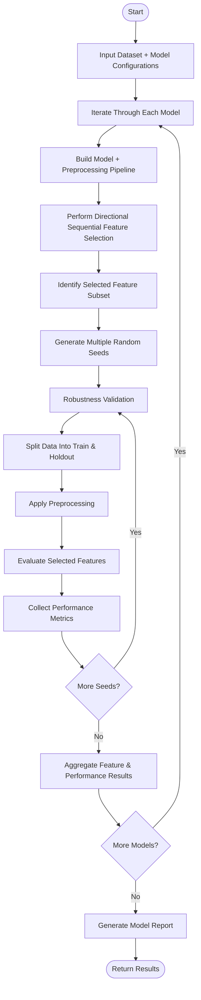

# Feature Selection

## 1. Filter Methods

### 1. Correlation Methods
    - pearson
    - kendalltau
    - spearman

### 2. Statistical Tests
    - test of normality
    - t_test of independence
    - chi2_test of independence
    - ANOVA

### 2. Mutual Information
    - f-test : f_classify, f_regression
    - mutual_information : mutual_info_classify, mutual_info_regression

### 3. Variance Threshold
    - variance of threshold method

## 2. Wrapper Methods

**input:**

- data:
    - dataframe
    - features
    - target

- model:
    - preprocessor
    - scaler_type
    - use_smote

- experiment:
    - seed
    - shuffle
    - n_splits
    - n_repeats
    - bins

- eveluation:
    - scoring

### 1. Forward Fetaure Selection

**process:**

output:

1. report of run (model name , corresponding columns .....)
2. all models

### 2. backword feature elimintaion

### 3. recursive fetaure elimination

input:

data:

    1. dataframe,
    2. features,
    3. target,

model:
    4. preprocessor,
    5. scaler_type,
    6. use_smote,

experiment:
    7. seed,
    8. shuffle
    9. n_splits
    10. n_repeats
    11. bins

eveluation:
    scoring

process:

output:

1. report of run (model name , corresponding columns .....)
2. all models
3.

## evaluation plot

### column 1: model performance stability (grouped bar chart)

This plot answers: *"Which model is the most reliable and highest performing?"* 

- **Y-Axis:** Model names (e.g., `RandomForest`, `XGBoost`, `SVM`).
- **X-Axis:** Score (0 to 1).
- **Bars:** Grouped bars for each model: **F1-Score**, **Recall**, and **Precision**.
- **Error Bars (The "Robustness" Indicator):** Use the Standard Deviation (STD) from your 50 runs (&(5\text{\ folds}\times 10\text{\ repeats})$) as whiskers on the bars.

    - **Insight:** A high bar with a short whisker means the model is excellent and stable. A high bar with a long whisker means the model is "lucky" on some splits but unreliable for production.

### Column 2: Feature Importance Heatmap (Selection Frequency)

This plot answers: *"Which features are truly driving the decisions across all iterations?"*

- **Y-Axis:** Model names (matches Plot 1).
- **X-Axis:** Feature names.
- **Cell Value (Intensity)**: The **Stability Score**.
- **Normalization Logic:**

Instead of just raw frequency, calculate the cell value as:

$$
\text{Score = } \frac{\text{Selection Frequency}}{\text{Total Runs}} X \text{Avg Performance (F1)}
$$

- **Why?** This penalizes features that were only selected by poorly performing models and highlights features that were consistently chosen by the most accurate models.
